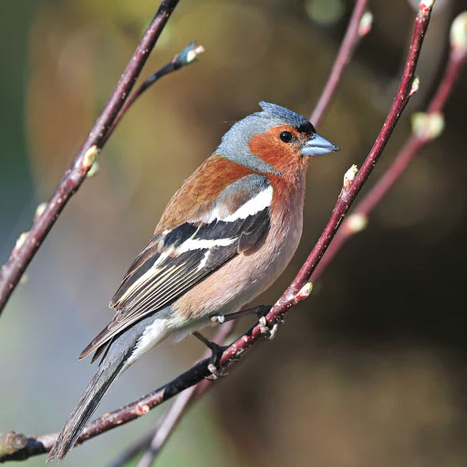

```{r setup, include=FALSE}
knitr::opts_chunk$set(echo = FALSE,
                      warning = FALSE,
                      message = FALSE,
                      fig.retina = 3)
```

```{r packages}
library(tidyverse)
library(ggplot2)
```

```{r importing}
chaff <- read_table2("https://3mmarand.github.io/BIO00058M-Data-science-2020/data-raw/chaff.txt") %>% 
  janitor::clean_names()

```

```{r tidying}
chaff2 <- gather(data = chaff, key = sex, value = max)

```

```{r functions}
sum_sq <- function(df, measure, group) {
  df %>% group_by({{ group }}) %>% 
    summarise(ss = sum(({{measure}} - mean({{measure}}))^2))
}

sum_sq(chaff2, max, sex)

data_summary <- function(df, measure, group) {
  df %>% group_by({{ group }}) %>% 
    summarise(mean_max = mean({{ measure }}),
            sd = sd({{ measure }}),
            se = plotrix::std.error({{ measure }}),
            n = length({{ measure }}))
}

data_summary(chaff2, max, sex)
```

```{r summarise}
chaff_summary <- chaff2 %>% 
  group_by(sex) %>% 
  summarise(mean_max = mean(max),
            sd = sd(max),
            se = plotrix::std.error(max),
            n = length(max))

```

```{r human index}
filesol <- "Y101_Y102_Y201_Y202_Y101-5.csv"

#Skip first 2 rows as they dont include important info and tidy
sol <- read_csv(filesol, skip = 2) %>% 
  janitor::clean_names()

#Filter the data to keep rows of human proteins identified by more than one peptide
sol <- sol %>% 
  filter(str_detect(description, "OS=Homo sapiens")) %>% 
  filter(x1pep == "x")

#Extract top protein identifier and put in column protid
sol <- sol %>%
  mutate(protid =  str_extract(accession, ".::[^|;]+") %>% 
           str_replace(".::", ""))

#Extract genename from the description and put it into a column
sol <- sol %>%
  mutate(genename =  str_extract(description,"GN=[^\\s]+") %>% 
           str_replace("GN=", ""))


#Converting the data to tidy format - giving abundance and lineage_rep their own column
sol2 <- sol %>% 
  pivot_longer(names_to = "lineage_rep",
               values_to = "abundance",
               cols = -c(accession, peptide_count, unique_peptides, confidence_score, anova_p, q_value,
                         max_fold_change, power, highest_mean_condition, lowest_mean_condition, mass, description, x1pep, genename, protid))

#Creating unique columns for lineage and rep
sol3 <- sol2 %>% 
  extract(lineage_rep, 
          c("lineage", "rep"),
          "(y[0-9]{3,4})\\_([a-z])")


sol3
```


# Introduction
This is the introduction!!!! [@tidyverse] [@rcore]

This is a bird.\@ref(fig:chaff-fig)

(ref:chaff-fig) Chaff. By Photo © Julia Trafford, http://voice.gardenbird.co.uk/all-about-the-chaffinch/
```{r chaff-fig, out.height="200px", fig.cap='(ref:chaff-fig)'}

# Import image into the knit - automatically names the figure so doesnt need to be
# changed if more figures are added later
# This is done by giving the chunk a name (r weddell-fig) and caption (fig.cap='(ref:weddell-fig)')
#(fig.cap='(ref:weddell-fig)') is used so that the whole legend does not have to be typed out each time
#The legend is above (outside the chunk) with the name (ref:weddell-fig) - this is then used instead of the legend text
```


# Methods
This is the methods!!! 

# Results
```{r statistical analysis}
data_summary(chaff2, max, sex)
t.test(data = chaff2, max~sex)
```
this is figure \@ref(fig:max-fig)
```{r max-fig, fig.height=4, fig.width=4, fig.cap="(ref:max-fig)"}

ggplot() +
  geom_point(data = chaff2, aes(x = sex, y = max),
             position = position_jitter(width = 0.1, height = 0),
             colour = "gray50")+
  theme_classic()

```


# Discussion

# References
